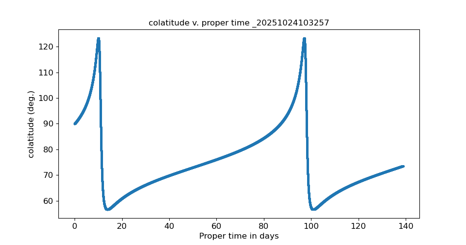
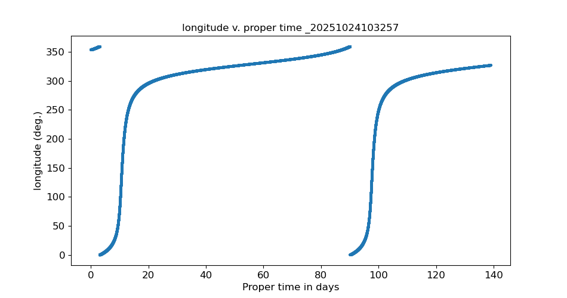
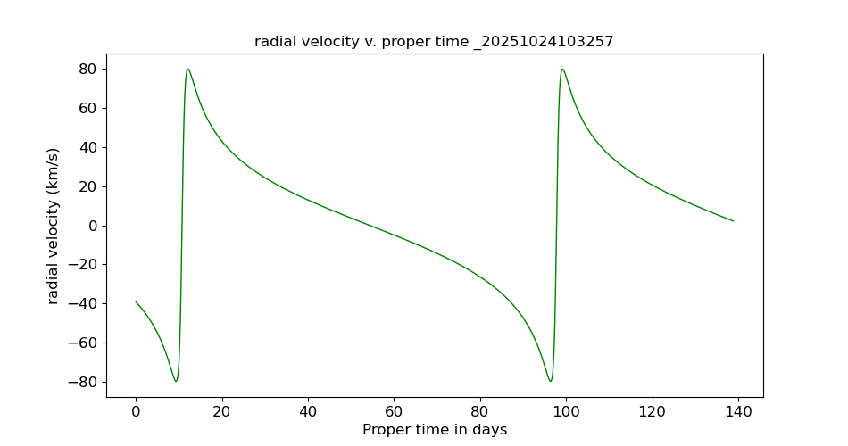
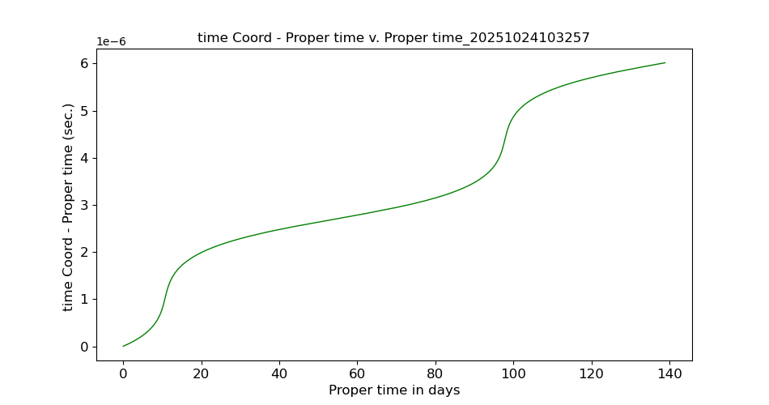
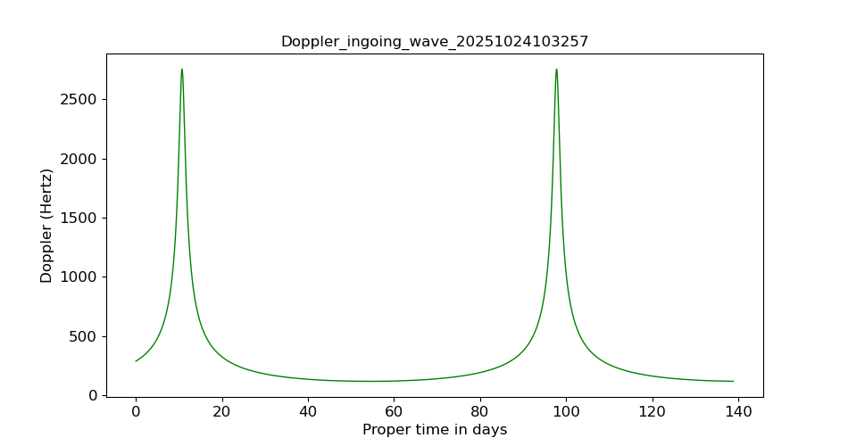
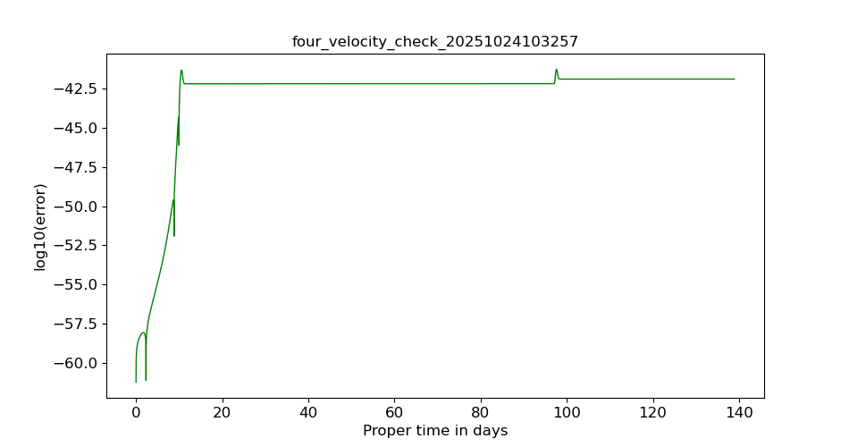
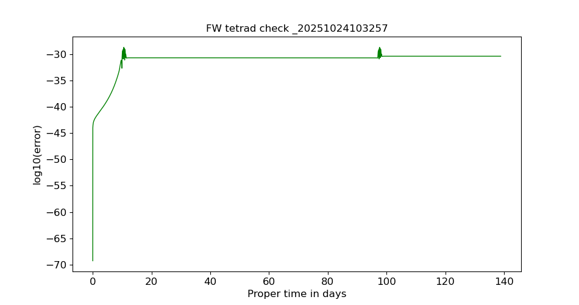

# 🪐 GRAPE — General Relativity Accelerometer-based Propagation Environment

**Authors:** JP. Barriot, J. O’Leary, J. Ya, JM. Mari
**License:** MIT  
**Version:** 1.0 — October 2025  
**Journal:** *Software X* (submitted)

---

## 🚀 Overview

**GRAPE** (General Relativity Accelerometer-based Propagation Environment)  
is a Julia-based framework for simulating spacecraft trajectories in a **fully relativistic formulation**.

It integrates the motion of a spacecraft within arbitrary spacetime metrics (Schwarzschild, Kerr, Newtonian approximations, etc.), including **non-gravitational forces** and **accelerometer-based models**.

This repository contains:
- The **core engine** written in Julia (`src/GRAPE_core.jl`)
- A simplified **example** (Parker Solar Probe)
- Several **reproducible capsules** (Software X standard)

---

## 🧩 Capsule Types

GRAPE provides four reproducible environments:

| Capsule | Description | Reproducibility level |
|----------|--------------|------------------------|
| 🟩 **Light Capsule** | For users with Julia already installed | Code-only |
| 🟨 **Docker-Light Capsule** | Automatic build in official Julia Docker | Environment-fixed |
| 🟦 **Full Docker Capsule** | Includes menu and execution options | Interactive |
| 🟥 **Installer Capsule** | Installs Julia and runs GRAPE automatically (Windows/Linux) | Fully automated |

---

## 📁 Repository Structure
```text
GRAPE/
│
├── src/                            # Core physical and mathematical routines
│   └── GRAPE_core.jl
│
├── examples/                       # Demonstration cases
│   ├── example_ParkerSolarProbe.jl
│   └── example_simplified_no_tetrad.jl
│
├── capsule_julia_light/            # Light capsule (Julia already installed)
│   └── readme                      # Instructions for quick local run
│
├── capsule_docker_light/           # Docker light capsule (Julia official image)
│   ├── Dockerfile
│   └── readme                      # Minimal instructions
│
├── capsule_docker_full/            # Full interactive Docker capsule
│   ├── Dockerfile
│   ├── start_menu.sh               # Interactive shell menu (dialog-based)
│   └── readme                      # Usage instructions
│
├── capsule_julia_install/          # Auto-installers (Windows & Linux)
│   ├── install_grape.ps1           # PowerShell installer for Windows
│   ├── install_grape.sh            # Bash installer for Linux/macOS
│   └── readme                      # Usage instructions
│
├── LICENSE                         # MIT license
└── README.md                       # Main documentation (this file)```

## 📊 Output and Results

Running the **Parker Solar Probe example** produces a set of text files and graphical outputs in the `output/` directory.  
These figures illustrate both the **relativistic orbital behavior** and **internal consistency checks** of the simulation.

---

### 🪐 Orbital Geometry

| Figure | Description |
|---------|--------------|
| 20251024103257.png) | **Polar orbit projection** in Schwarzschild coordinates (r, θ). Shows the variation of the probe’s radius with respect to colatitude. |
|  | **3D trajectory** reconstructed from the integration results. The trajectory plane is slightly inclined, showing spatial precession. |
| 20251024103257.png) | **Azimuthal orbit projection** (r, φ). Highlights perihelion advance due to relativistic effects. |

---

### 🧭 Kinematic Evolution

| Figure | Description |
|---------|--------------|
|  | Time evolution of the **colatitude** (in degrees) as a function of **proper time** (days). |
|  | Variation of **longitude** with respect to proper time, illustrating orbital precession. |
|  | **Radial velocity** (km/s) as a function of proper time. Peaks correspond to perihelion passages. |

---

### ⏱️ Relativistic Effects

| Figure | Description |
|---------|--------------|
|  | Difference between **coordinate time** and **proper time** (Δt − τ). Reveals the cumulative relativistic time dilation over the orbit. |
|  | **Relativistic Doppler shift** for the ingoing electromagnetic wave. The double-peak structure matches perihelion approach/recession. |

---

### 🧪 Numerical Accuracy Checks

| Figure | Description |
|---------|--------------|
|  | Logarithm of the **four-velocity normalization error**. The invariant 4-velocity norm remains constant to better than 10⁻⁴². |
|  | Verification of the **Fermi–Walker transported tetrad orthonormality**. Error remains below 10⁻³⁰, confirming numerical stability. |

---

### 📂 Generated Files

The simulation produces the following files (timestamped):

| File | Description |
|------|--------------|
| `SCephemeris_<timestamp>.txt` | Spacecraft state vector at each integration step |
| `orbit(r,theta)_<timestamp>.png` | 2D polar plot of the orbit |
| `orbit3D_<timestamp>.png` | 3D orbit visualization |
| `Doppler_<timestamp>.png` | Doppler shift evolution |
| `FWtetrad_check_<timestamp>.png` | Fermi–Walker tetrad orthonormality error |
| `four_velocity_check_<timestamp>.png` | Four-velocity normalization verification |

All plots are automatically saved in **`output/`**, and filenames include a **timestamp** (e.g. `_20251024103257`) for traceability.

---

### 🔎 Interpretation

- The two strong peaks in Doppler and radial velocity correspond to the probe’s **perihelion passes**.  
- The difference between coordinate and proper time highlights the **relativistic time dilation** integrated over multiple orbits.  
- The numerical error plots confirm **machine-precision conservation** of the 4-velocity and tetrad normalization, validating the integrator’s symplectic accuracy.

---

### 🧠 Summary

These results confirm that **GRAPE reproduces stable and relativistically consistent trajectories** for near-solar orbits, with physical accuracy better than 10⁻³⁰ in all conserved quantities.  
The example thus provides a strong **reproducibility benchmark** for Software X reviewers and users.
