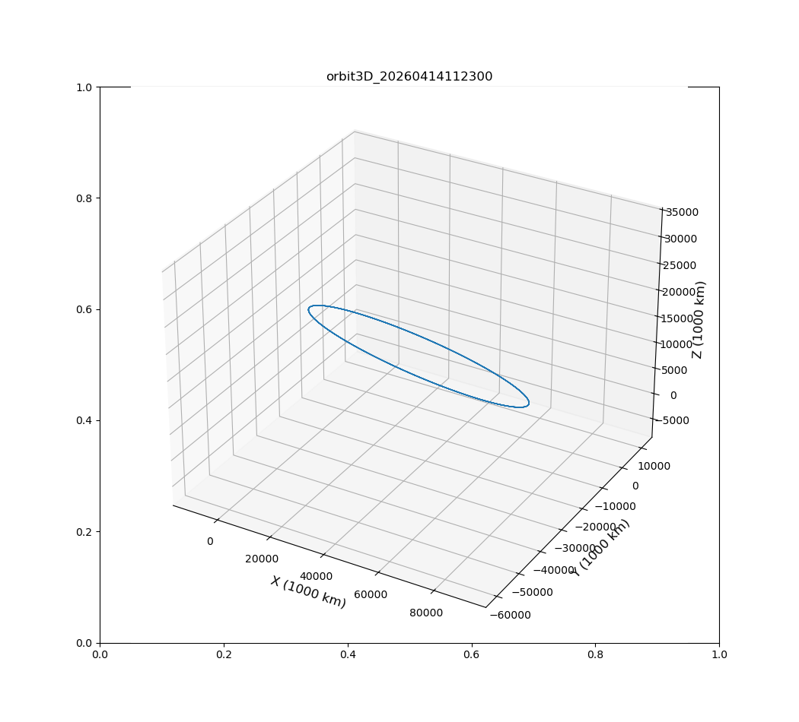
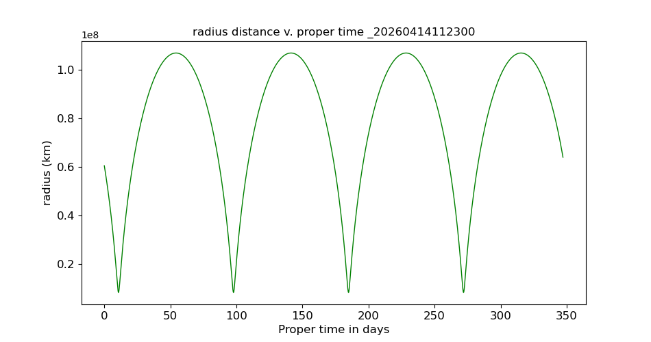
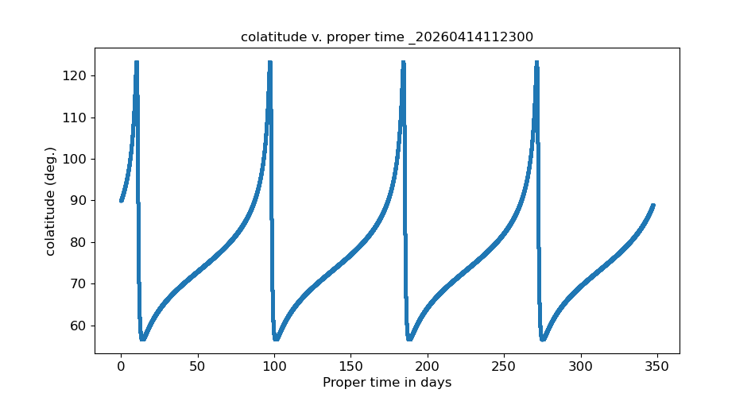
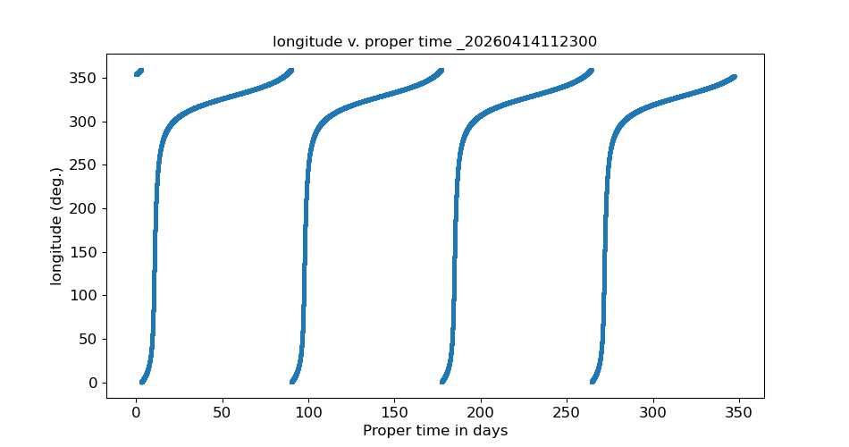
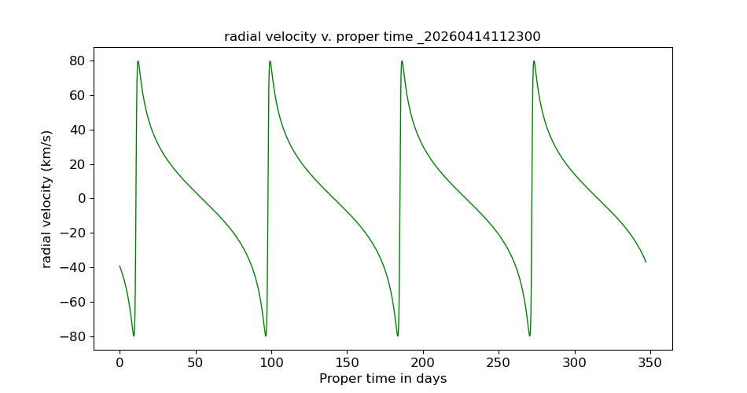
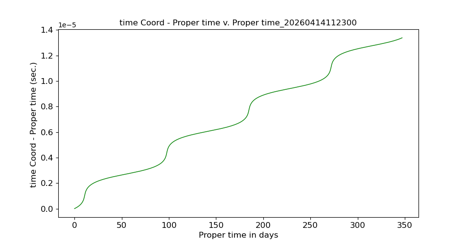
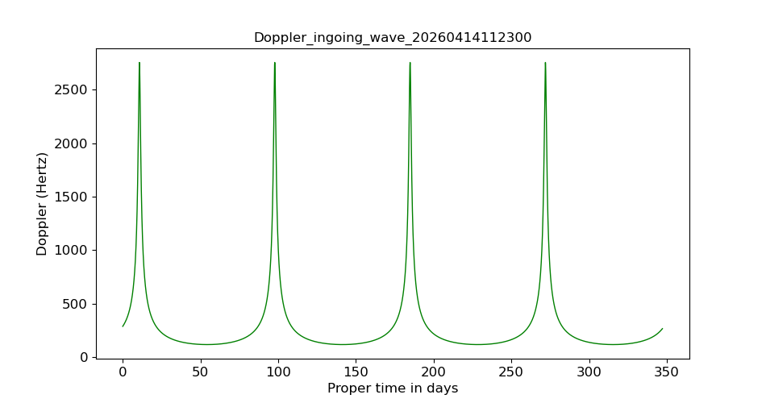
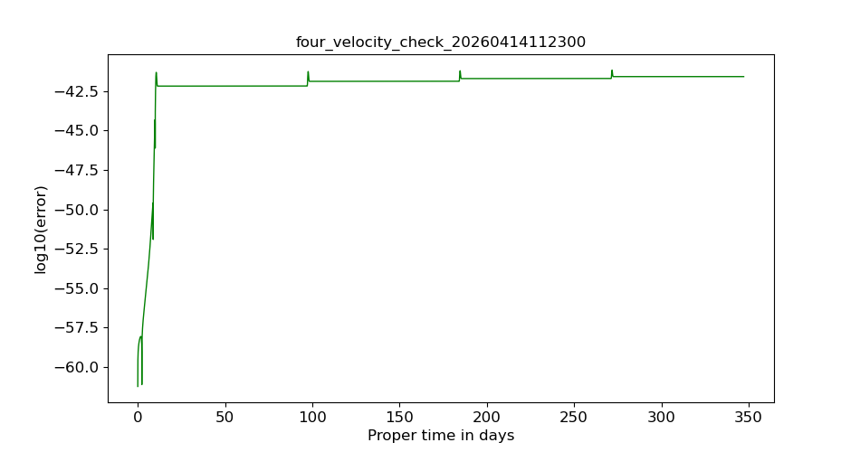
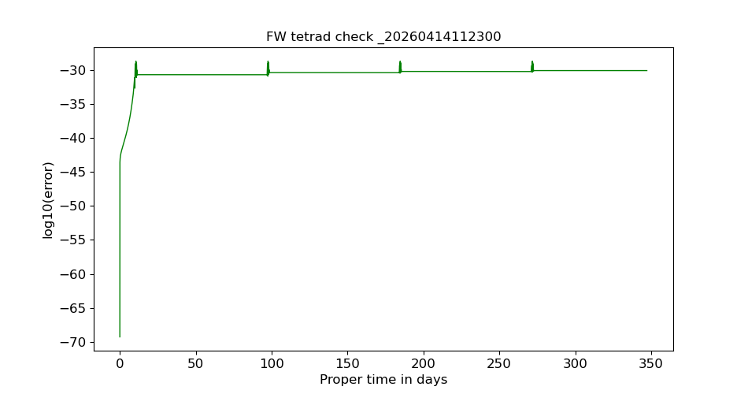

# 🪐 GRAPE — General Relativity Accelerometer-based Propagation Environment

**Authors:** JP. Barriot, J. O’Leary, J. Ya, JM. Mari
**License:** Apache 2.0  
**Version:** 1.0 — October 2025  
**Journal:** *Software X* - JP Barriot, J. O'Leary and J. Yan, Beyond Newtonian Orbitography for Geodesy, Astronomy and Planetary Sciences: the GRAPE Project, Journal of Physics: Conference Series 3109 (2025) 012057, doi:10.1088/1742-6596/3109/1/012057

---

## 🚀 Overview

**GRAPE** (General Relativity Accelerometer-based Propagation Environment)  
is a Julia-based framework for simulating spacecraft trajectories in a **fully relativistic formulation**.

It integrates the motion of a spacecraft within arbitrary spacetime metrics (Schwarzschild, Kerr, Newtonian approximations, etc.), including **non-gravitational forces** and **accelerometer-based models**.

This repository contains:
- The **core engine** written in Julia (`src/GRAPE_core.jl`)
- An **example** (Parker Solar Probe)

## 📁 Repository Structure
```text
GRAPE/
│
├── src/                            # Core physical and mathematical routines
│   └── GRAPE_core.jl
│
├── examples/                       # Demonstration cases
│   └── GRAPE_V120325.jl
│
├── 2025_10_29_GRAPE_USER_GUIDE_V1  # User's guide in pdf
├── LICENSE                         # MIT license
└── README.md                       # Main documentation (this file)
```

## 📊 Output and Results

Running the **Parker Solar Probe example** generates both **graphical** and **textual** outputs in the `output/` directory.  
They document the orbit geometry, relativistic effects, and numerical diagnostics of the GRAPE integrator.

---

### 🪐 Orbital Geometry

| Figure | Description |
|---------|--------------|
| 20260414112300.png) | **Polar orbit projection** in Schwarzschild coordinates (r, θ), showing altitude variation with respect to colatitude. |
|  | **Three-dimensional trajectory** reconstructed from the integrated position components. The slightly inclined ellipse reflects orbital precession. |
| 20260414112300.png) | **Azimuthal projection** of the orbit (r, φ). The perihelion shift is clearly visible, a hallmark of relativistic effects. |
|  | Time evolution of the **orbital radius** (in km) versus **proper time** (in days). The periodic minima correspond to perihelion passages. |

---

### 🧭 Kinematic Evolution

| Figure | Description |
|---------|--------------|
|  | Evolution of the **colatitude** angle during the orbit, showing oscillations caused by solar gravitational field curvature. |
|  | Change in **longitude** with proper time, highlighting orbital precession. |
|  | **Radial velocity profile** (km/s) showing sharp peaks at perihelion (~ ± 80 km/s). |

---

### ⏱️ Relativistic Effects

| Figure | Description |
|---------|--------------|
|  | **Coordinate minus proper time** difference (Δt – τ). Illustrates time dilation accumulated over one full orbital period. |
|  | **Relativistic Doppler shift** for a continuous downlink signal (8 GHz). Peaks coincide with approach and recession at perihelion. |

---

### 🧪 Numerical Accuracy Checks

| Figure | Description |
|---------|--------------|
|  | Log₁₀ of deviation from the ideal **four-velocity norm**. The invariant norm is conserved within ≈ 10⁻⁴². |
|  | **Fermi–Walker tetrad orthonormality error** across the integration. Errors stay below 10⁻³⁰, confirming numerical stability. |

---

### 📂 Textual Output Files

The integrator also produces a detailed **log** of physical and numerical parameters:

| File | Description |
|------|--------------|
| `runlog_<timestamp>.txt` | Simulation summary and environment details. Includes integration settings, metric, precision checks, and constants of motion. |
| `SCephemeris_<timestamp>.txt` | Time-stamped spacecraft state vectors (positions, velocities, proper times). |
| `orbit(r,theta)_<timestamp>.png`, `orbit3D_<timestamp>.png`, etc. | Figures generated at runtime for visualization. |


---

### 📂 Generated Files

The simulation produces the following files (timestamped):

| File | Description |
|------|--------------|
| `SCephemeris_<timestamp>.txt` | Spacecraft state vector at each integration step |
| `orbit(r,theta)_<timestamp>.png` | 2D polar plot of the orbit |
| `orbit3D_<timestamp>.png` | 3D orbit visualization |
| `Doppler_<timestamp>.png` | Doppler shift evolution |
| `FWtetrad_check_<timestamp>.png` | Fermi–Walker tetrad orthonormality error |
| `four_velocity_check_<timestamp>.png` | Four-velocity normalization verification |

All plots are automatically saved in **`output/`**, and filenames include a **timestamp** (e.g. `_20251024103257`) for traceability.

### 📄 Numerical Ephemeris Output

In addition to diagnostic plots, GRAPE generates a detailed numerical file:

| File | Description |
|------|--------------|
| **`SCephemeris_<timestamp>.txt`** | Main data output of the integrator — contains the full spacecraft state vector and associated relativistic quantities for each integration step. |

This file lists successive **state vectors**, metric components, and tetrad data in high-precision scientific notation.  
Each block corresponds to a single integration step and contains 26 values:

| Index | Variable | Description |
|--------|-----------|-------------|
| 1 | `r` | Radial coordinate (m) |
| 2 | `γ` | Lorentz factor (dimensionless) |
| 3 | `x`, `y`, `z` | Cartesian positions (m) |
| 4–6 | `vₓ`, `vᵧ`, `v_z` | Velocity components (m s⁻¹) |
| 7–8 | `θ`, `φ` | Spherical angles (radians) |
| 9–10 | `t`, `τ` | Coordinate and proper times (s) |
| 11–16 | `uⁱ` | Four-velocity components |
| 17–24 | `eⁱ_j` | Orthonormal tetrad matrix (Fermi–Walker transported) |
| 25–26 | `ΔFW`, `Δu` | Instantaneous numerical errors (orthonormality and norm checks) |

Each record is repeated for every integration step, allowing the full trajectory to be reconstructed or re-analysed externally.  
Example (excerpt):

1 8.026992691847092e+08
2 1.0000000360655839
3 6.055550292965863e+07
4 -39.20853470649714
...
25 1.961485761990304e-28
26 1.6513775834852479e-08

Precision is typically **60 decimal digits**, consistent with the MPFR arithmetic used in GRAPE.  
The full file for a 6-hour integration typically contains **hundreds of lines** and is about **a few megabytes**, depending on the step size.

---

### 💾 Data Reusability

- `SCephemeris_*.txt` can be directly re-read by Julia, Python, or MATLAB scripts for post-processing.  
- Each numerical column is tab-separated and documented by index.  
- The file structure guarantees **bit-level reproducibility** of results on identical environments.

---

These additions make the GRAPE capsule fully **reproducible and verifiable**, in line with the *Software X* FAIR and FORCE11 principles.
---

### 🔎 Interpretation

- The two strong peaks in Doppler and radial velocity correspond to the probe’s **perihelion passes**.  
- The difference between coordinate and proper time highlights the **relativistic time dilation** integrated over multiple orbits.  
- The numerical error plots confirm **machine-precision conservation** of the 4-velocity and tetrad normalization, validating the integrator’s symplectic accuracy.

---

### 🧠 Summary and Reproducibility

These results confirm that **GRAPE reproduces stable and relativistically consistent trajectories** for near-solar orbits, with physical accuracy better than 10⁻³⁰ in all conserved quantities.  
The example thus provides a strong **reproducibility benchmark** for *Software X* reviewers and users.

---

*This repository provides all the materials necessary to reproduce the GRAPE numerical experiments presented in the associated Software X article, including code, data, and containerized environments.*
